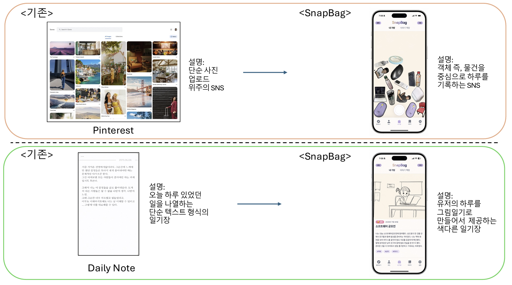

# SnapBag

숭실대학교 컴퓨터학부 소프트웨어공모전 2026 프로젝트

SnapBag은 하루 동안 마주친 물건을 사진으로 모으고, 가방처럼 쌓아 공유하는 SNS입니다.  
기존 SNS가 사진 전체의 구도, 인물, 배경을 중심으로 기록한다면 SnapBag은 사진 속 "객체 하나"에 집중합니다. 사용자는 예쁜 사진을 찍어야 한다는 부담보다, 오늘 발견한 사물들을 수집하듯 담아가는 재미를 경험할 수 있습니다.

  

## 프로젝트 소개

SnapBag은 카메라로 찍은 사진에서 AI가 물건을 분리하고, 분리된 객체를 사용자의 가방 안에 떨어뜨려 쌓는 앱입니다.  
가방 안의 물건들은 물리 엔진을 통해 서로 부딪히고, 휴대폰을 기울이거나 흔들면 실제 물건처럼 움직입니다.

친구의 가방을 구경하거나, 다른 사용자의 가방을 둘러보고, 하루의 물건들을 바탕으로 AI 그림일기를 생성하는 기능도 제공합니다.

## 핵심 차별점

| 기존 SNS | SnapBag |
| --- | --- |
| 사진 전체의 분위기, 구도, 인물을 중심으로 공유 | 사진 속 물건 하나하나를 중심으로 기록 |
| 예쁜 사진을 찍어야 한다는 부담이 큼 | 일상에서 발견한 물건을 가볍게 담을 수 있음 |
| 피드에 게시물이 시간순으로 쌓임 | 내 가방 안에 물건이 물리적으로 쌓임 |
| 하루를 텍스트나 사진첩 형태로 회고 | 오늘의 물건을 바탕으로 AI 그림일기 생성 |

## 주요 기능

### 1. 내 가방

- 사진 촬영 후 AI 서버가 사진 속 객체를 탐지합니다.
- 선택한 물건을 SAM2로 분리해 배경이 제거된 객체 이미지로 저장합니다.
- 저장된 물건은 내 가방 안에 떨어지고, Matter.js 물리 엔진을 통해 다른 물건과 상호작용합니다.
- 휴대폰의 기울기와 흔들림에 반응해 물건들이 움직입니다.
- 물건을 길게 누르면 상세 카드에서 제목, 기록, 촬영 위치를 확인할 수 있습니다.

### 2. 피드

- 친구들의 프로필을 가로 스크롤로 확인할 수 있습니다.
- 친구를 선택하면 해당 친구의 가방을 볼 수 있습니다.
- 친구의 물건을 길게 누르면 물건 상세 정보 카드를 확인할 수 있습니다.

### 3. 둘러보기

- 친구가 아니더라도 공개된 사용자들의 가방을 탐색할 수 있습니다.
- 카드형 캐러셀 UI로 여러 사용자의 가방을 넘겨볼 수 있습니다.

### 4. 이야기

- 오늘 찍은 물건들을 기반으로 하루의 이야기를 생성합니다.
- 사용자가 작성한 짧은 하루 기록과 가방 속 물건을 함께 활용합니다.
- 생성된 이야기는 그림일기 형태로 확인할 수 있습니다.

### 5. 설정

- Supabase Authentication과 연동된 로그인, 회원가입, 이메일 변경, 비밀번호 변경을 제공합니다.
- 프로필 사진을 촬영하거나 갤러리에서 선택해 변경할 수 있습니다.
- 친구 관리, 이용 안내, 문의하기 기능을 제공합니다.

## 기술 스택

### App

- Expo SDK 54
- React Native
- TypeScript
- Expo Router
- Matter.js
- Supabase JS SDK
- React Native Maps

### Backend / Storage

- Supabase Authentication
- Supabase Database
- Supabase Storage
- Supabase Row Level Security

### AI Server

- FastAPI
- Uvicorn
- Gemini API
- Grounding DINO
- SAM2

## 프로젝트 의의

SnapBag은 사진을 "잘 찍는 것"보다 "오늘 무엇을 만났는지"에 집중합니다.  
사용자는 하루 동안 본 물건을 수집하고, 가방 속에 쌓인 물건을 통해 자신의 일상을 독특한 방식으로 표현할 수 있습니다.

사진 전체가 아니라 객체 하나를 중심으로 기록한다는 점에서, SnapBag은 기존 SNS와 다른 가볍고 수집적인 공유 경험을 제안합니다.
